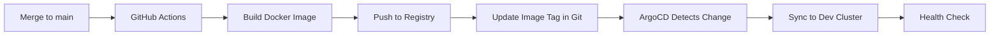
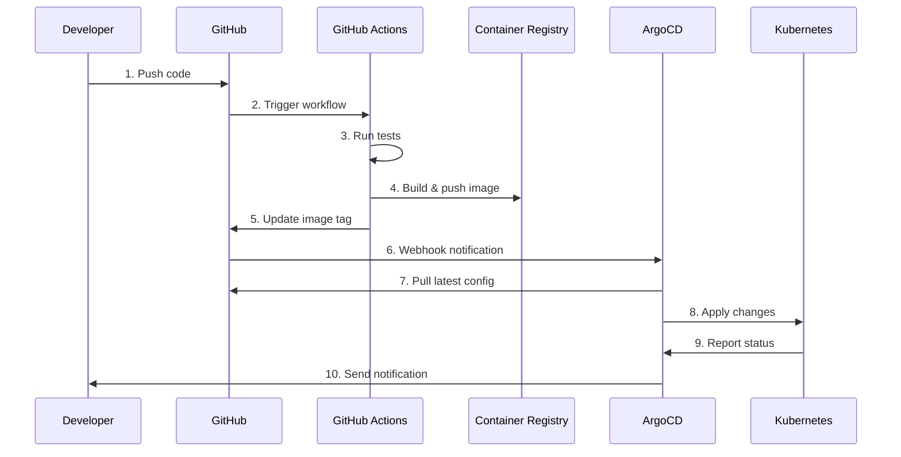

# GitOps Workflow for Fluxion

This guide describes the complete GitOps workflow for developing, deploying, and managing the Fluxion application using ArgoCD.

## Table of Contents

- [Overview](#overview)
- [GitOps Principles](#gitops-principles)
- [Repository Structure](#repository-structure)
- [Development Workflow](#development-workflow)
- [Deployment Pipeline](#deployment-pipeline)
- [Environment Promotion](#environment-promotion)
- [Rollback Procedures](#rollback-procedures)
- [Best Practices](#best-practices)
- [Troubleshooting](#troubleshooting)

## Overview

### What is GitOps?

GitOps is a way of implementing Continuous Deployment for cloud-native applications. It uses Git as the single source of truth for declarative infrastructure and applications.

### Benefits for Fluxion

- **Declarative**: All infrastructure and application configuration is declared in Git
- **Versioned**: Every change is tracked with full Git history
- **Automated**: Changes are automatically applied to the cluster
- **Auditable**: Complete audit trail of who changed what and when
- **Recoverable**: Easy rollback to any previous state
- **Consistent**: Same workflow for all environments

### Architecture

```
Developer → Git Push → GitHub → ArgoCD → Kubernetes Cluster → Fluxion
                                   ↓
                              Monitors Git
                                   ↓
                            Syncs Changes
```

## GitOps Principles

### 1. Declarative

Everything is declared in Git:
- Application code
- Kubernetes manifests
- Helm charts
- ArgoCD applications
- Configuration values

### 2. Versioned and Immutable

- All changes are committed to Git
- Git history provides complete audit trail
- Tags mark releases
- Branches separate environments

### 3. Pulled Automatically

- ArgoCD monitors Git repository
- Changes are automatically pulled
- No push access to cluster needed
- Reduces security attack surface

### 4. Continuously Reconciled

- ArgoCD continuously monitors cluster state
- Detects drift from Git
- Self-heals to match Git state
- Alerts on sync issues

## Repository Structure

```
fluxion/
├── backend/                    # Backend application code
├── frontend/                   # Frontend application code
├── deploy/
│   ├── argocd/
│   │   ├── root-app.yaml      # App-of-Apps pattern
│   │   ├── projects/
│   │   │   └── fluxion-project.yaml
│   │   ├── apps/              # ArgoCD Application manifests
│   │   │   ├── fluxion-dev.yaml
│   │   │   ├── fluxion-staging.yaml
│   │   │   ├── fluxion-production.yaml
│   │   │   └── observability.yaml
│   │   └── bootstrap/         # ArgoCD installation
│   └── helm/
│       └── fluxion/
│           ├── Chart.yaml
│           ├── values.yaml    # Default values
│           ├── values-dev.yaml
│           ├── values-staging.yaml
│           ├── values-production.yaml
│           └── templates/     # Kubernetes manifests
└── .github/
    └── workflows/             # CI/CD workflows
```

## Development Workflow

### 1. Local Development

```bash
# Clone repository
git clone https://github.com/wesback/fluxion.git
cd fluxion

# Create feature branch
git checkout -b feature/add-new-endpoint

# Make changes to code
vim backend/fluxion/api/endpoints.py

# Test locally
cd backend
pytest

# Test with docker-compose
cd ..
docker-compose up

# Verify changes work
curl http://localhost:8000/api/v1/new-endpoint
```

### 2. Update Kubernetes Manifests

If Kubernetes configuration changes:

```bash
# Update Helm values or templates
vim deploy/helm/fluxion/values-dev.yaml

# Test Helm chart rendering
helm template fluxion deploy/helm/fluxion \
  -f deploy/helm/fluxion/values-dev.yaml

# Validate manifests
helm lint deploy/helm/fluxion

# Check for issues
kubectl apply --dry-run=client -f <(helm template fluxion deploy/helm/fluxion)
```

### 3. Commit Changes

```bash
# Stage changes
git add .

# Commit with descriptive message
git commit -m "feat: add new endpoint for package search

- Add GET /api/v1/packages/search endpoint
- Add pagination support
- Add filtering by package name
- Update Helm chart with new environment variables"

# Push to GitHub
git push origin feature/add-new-endpoint
```

### 4. Create Pull Request

```bash
# Create PR using GitHub CLI
gh pr create \
  --title "Add package search endpoint" \
  --body "Implements #123: Package search functionality" \
  --base main

# Or create via GitHub UI
```

### 5. Code Review

```yaml
# .github/CODEOWNERS
deploy/ @fluxion-devops
backend/ @fluxion-backend-team
frontend/ @fluxion-frontend-team
```

Review checklist:
- [ ] Code follows style guidelines
- [ ] Tests pass
- [ ] Documentation updated
- [ ] Helm values updated (if needed)
- [ ] Security best practices followed
- [ ] Breaking changes documented

### 6. CI/CD Pipeline

GitHub Actions automatically:

```yaml
# .github/workflows/ci.yaml
name: CI
on: [pull_request]
jobs:
  test:
    runs-on: ubuntu-latest
    steps:
    - uses: actions/checkout@v3
    
    - name: Run tests
      run: |
        cd backend
        pytest
    
    - name: Lint Helm charts
      run: |
        helm lint deploy/helm/fluxion
    
    - name: Validate Kubernetes manifests
      run: |
        helm template fluxion deploy/helm/fluxion | \
          kubectl apply --dry-run=client -f -
```

### 7. Merge to Main

After approval:

```bash
# Merge PR
gh pr merge --squash

# Or via GitHub UI
```

## Deployment Pipeline

### Automatic Deployment to Development



#### 1. Build and Push Image

```yaml
# .github/workflows/deploy.yaml
name: Deploy
on:
  push:
    branches: [main]
jobs:
  build:
    runs-on: ubuntu-latest
    steps:
    - uses: actions/checkout@v3
    
    - name: Build Docker image
      run: |
        docker build -t ghcr.io/wesback/fluxion:${{ github.sha }} backend/
    
    - name: Push to registry
      run: |
        echo "${{ secrets.GITHUB_TOKEN }}" | docker login ghcr.io -u ${{ github.actor }} --password-stdin
        docker push ghcr.io/wesback/fluxion:${{ github.sha }}
        docker tag ghcr.io/wesback/fluxion:${{ github.sha }} ghcr.io/wesback/fluxion:latest
        docker push ghcr.io/wesback/fluxion:latest
```

#### 2. Update Development Values

**Option A: Manual Update**

```bash
# Update image tag in dev values
vim deploy/helm/fluxion/values-dev.yaml

# Change:
image:
  tag: "v1.2.3"

# Commit and push
git add deploy/helm/fluxion/values-dev.yaml
git commit -m "chore: update dev image to v1.2.3"
git push origin main
```

**Option B: ArgoCD Image Updater (Automated)**

ArgoCD Image Updater automatically updates image tags:

```yaml
# In deploy/argocd/apps/fluxion-dev.yaml
metadata:
  annotations:
    argocd-image-updater.argoproj.io/image-list: api=ghcr.io/wesback/fluxion
    argocd-image-updater.argoproj.io/api.update-strategy: latest
    argocd-image-updater.argoproj.io/write-back-method: git
```

See [IMAGE-UPDATER.md](IMAGE-UPDATER.md) for details.

#### 3. ArgoCD Syncs Changes

ArgoCD automatically:
1. Detects Git change
2. Renders Helm chart with new values
3. Applies changes to dev cluster
4. Monitors health of updated resources
5. Sends notification (if configured)

```bash
# Monitor deployment
argocd app get fluxion-dev

# Watch sync status
argocd app watch fluxion-dev

# View sync history
argocd app history fluxion-dev
```

### Manual Deployment to Staging

```bash
# 1. Update staging values
vim deploy/helm/fluxion/values-staging.yaml

# Update image tag
image:
  tag: "v1.2.3"

# 2. Commit changes
git add deploy/helm/fluxion/values-staging.yaml
git commit -m "chore: promote v1.2.3 to staging"
git push origin main

# 3. Verify in ArgoCD
argocd app get fluxion-staging

# 4. Sync application
argocd app sync fluxion-staging

# 5. Wait for healthy status
argocd app wait fluxion-staging --health

# 6. Run smoke tests
./scripts/smoke-test.sh staging
```

### Manual Deployment to Production

Production requires additional approval:

```bash
# 1. Create release branch
git checkout -b release/v1.2.3 main

# 2. Update production values
vim deploy/helm/fluxion/values-production.yaml

image:
  tag: "v1.2.3"

# 3. Create release PR
git add deploy/helm/fluxion/values-production.yaml
git commit -m "chore: release v1.2.3 to production"
git push origin release/v1.2.3

gh pr create \
  --title "Release v1.2.3 to Production" \
  --body "$(cat RELEASE_NOTES.md)" \
  --base main

# 4. After approval, merge PR
gh pr merge --merge

# 5. Manually sync in ArgoCD UI or CLI
argocd app sync fluxion-production

# 6. Monitor deployment
argocd app watch fluxion-production

# 7. Verify production health
./scripts/health-check.sh production

# 8. Tag release
git tag -a v1.2.3 -m "Release v1.2.3"
git push origin v1.2.3
```

## Environment Promotion

### Development → Staging

```bash
#!/bin/bash
# promote-to-staging.sh

VERSION=$1

if [ -z "$VERSION" ]; then
  echo "Usage: $0 <version>"
  exit 1
fi

# Update staging values
yq eval ".image.tag = \"$VERSION\"" -i deploy/helm/fluxion/values-staging.yaml

# Commit changes
git add deploy/helm/fluxion/values-staging.yaml
git commit -m "chore: promote $VERSION to staging"
git push origin main

# Sync via ArgoCD
argocd app sync fluxion-staging

echo "Promoted $VERSION to staging"
```

### Staging → Production

```bash
#!/bin/bash
# promote-to-production.sh

VERSION=$1

if [ -z "$VERSION" ]; then
  echo "Usage: $0 <version>"
  exit 1
fi

# Create release branch
git checkout -b release/$VERSION main

# Update production values
yq eval ".image.tag = \"$VERSION\"" -i deploy/helm/fluxion/values-production.yaml

# Update target revision to use tag
yq eval ".spec.source.targetRevision = \"$VERSION\"" -i deploy/argocd/apps/fluxion-production.yaml

# Commit changes
git add deploy/helm/fluxion/values-production.yaml deploy/argocd/apps/fluxion-production.yaml
git commit -m "chore: release $VERSION to production"
git push origin release/$VERSION

# Create PR
gh pr create \
  --title "Release $VERSION to Production" \
  --body "Release $VERSION to production environment" \
  --base main \
  --label release

echo "Created PR for $VERSION production release"
echo "After approval and merge, manually sync in ArgoCD"
```

## Rollback Procedures

### Rolling Back via Git

```bash
#!/bin/bash
# rollback.sh

ENVIRONMENT=$1
PREVIOUS_VERSION=$2

# Update values to previous version
yq eval ".image.tag = \"$PREVIOUS_VERSION\"" -i deploy/helm/fluxion/values-$ENVIRONMENT.yaml

# Commit rollback
git add deploy/helm/fluxion/values-$ENVIRONMENT.yaml
git commit -m "chore: rollback $ENVIRONMENT to $PREVIOUS_VERSION"
git push origin main

# Sync via ArgoCD
argocd app sync fluxion-$ENVIRONMENT

echo "Rolled back $ENVIRONMENT to $PREVIOUS_VERSION"
```

### Rolling Back via ArgoCD

```bash
# List application history
argocd app history fluxion-production

# Rollback to previous version
argocd app rollback fluxion-production

# Or rollback to specific revision
argocd app rollback fluxion-production 5

# Monitor rollback
argocd app watch fluxion-production
```

### Emergency Rollback

For critical production issues:

```bash
#!/bin/bash
# emergency-rollback.sh

ENVIRONMENT="production"

# Get previous successful revision
PREV_REVISION=$(argocd app history fluxion-$ENVIRONMENT | \
  grep "Succeeded" | tail -2 | head -1 | awk '{print $1}')

echo "Rolling back to revision $PREV_REVISION"

# Perform rollback
argocd app rollback fluxion-$ENVIRONMENT $PREV_REVISION

# Wait for rollback
argocd app wait fluxion-$ENVIRONMENT --health --timeout 300

# Verify
./scripts/health-check.sh $ENVIRONMENT

echo "Emergency rollback complete"
```

## Best Practices

### 1. Branch Strategy

```
main (production-ready)
  ├── develop (integration)
  ├── feature/* (new features)
  ├── bugfix/* (bug fixes)
  └── release/* (release candidates)
```

### 2. Commit Messages

Follow conventional commits:

```
feat: add new feature
fix: fix bug
chore: update dependencies
docs: update documentation
refactor: refactor code
test: add tests
ci: update CI/CD
perf: improve performance
```

### 3. Image Tagging Strategy

```
Development:   latest
Staging:       v1.2.3-rc.1
Production:    v1.2.3
```

### 4. Pull Request Template

```markdown
## Description
Brief description of changes

## Type of Change
- [ ] Bug fix
- [ ] New feature
- [ ] Breaking change
- [ ] Documentation update

## Testing
- [ ] Unit tests pass
- [ ] Integration tests pass
- [ ] Manual testing completed

## Deployment
- [ ] Helm chart updated
- [ ] Values files updated
- [ ] Documentation updated

## Checklist
- [ ] Code follows style guidelines
- [ ] Self-review completed
- [ ] Comments added for complex code
- [ ] Documentation updated
- [ ] No new warnings
- [ ] Tests added/updated
```

### 5. Release Process

```bash
# 1. Create release branch from main
git checkout -b release/v1.2.3 main

# 2. Update CHANGELOG.md
vim CHANGELOG.md

# 3. Update version in files
vim deploy/helm/fluxion/Chart.yaml  # version and appVersion

# 4. Commit release prep
git commit -am "chore: prepare release v1.2.3"

# 5. Create PR for release
gh pr create --title "Release v1.2.3"

# 6. After merge, tag release
git checkout main
git pull
git tag -a v1.2.3 -m "Release v1.2.3"
git push origin v1.2.3

# 7. Create GitHub release
gh release create v1.2.3 \
  --title "Release v1.2.3" \
  --notes "$(cat RELEASE_NOTES.md)"
```

### 6. Monitoring Deployments

```bash
# Monitor all applications
watch kubectl get applications -n argocd

# Monitor specific environment
argocd app watch fluxion-production

# Check sync status
argocd app get fluxion-production

# View application logs
kubectl logs -n fluxion-production -l app.kubernetes.io/name=fluxion -f
```

### 7. Handling Secrets

Never commit secrets to Git:

```bash
# Use Sealed Secrets
kubeseal --format=yaml < secret.yaml > sealed-secret.yaml
git add sealed-secret.yaml

# Or use External Secrets Operator
# See SECRETS.md for details
```

## Troubleshooting

### Application OutOfSync

```bash
# Check what's different
argocd app diff fluxion-production

# Force refresh from Git
argocd app get fluxion-production --refresh

# Hard refresh (clears cache)
argocd app get fluxion-production --hard-refresh

# Sync with force
argocd app sync fluxion-production --force
```

### Sync Failed

```bash
# Get sync status
argocd app get fluxion-production

# View sync operation details
kubectl describe application fluxion-production -n argocd

# Check ArgoCD logs
kubectl logs -n argocd -l app.kubernetes.io/name=argocd-application-controller
kubectl logs -n argocd -l app.kubernetes.io/name=argocd-repo-server
```

### Application Degraded

```bash
# Check pod status
kubectl get pods -n fluxion-production

# Check pod logs
kubectl logs -n fluxion-production -l app.kubernetes.io/name=fluxion

# Check events
kubectl get events -n fluxion-production --sort-by='.lastTimestamp'

# Describe resources
kubectl describe deployment fluxion-api -n fluxion-production
```

### Manual Intervention Required

```bash
# Temporarily disable auto-sync
kubectl patch application fluxion-production -n argocd \
  --type merge \
  -p '{"spec":{"syncPolicy":{"automated":null}}}'

# Make manual changes
kubectl edit deployment fluxion-api -n fluxion-production

# After fixing, re-enable auto-sync
kubectl patch application fluxion-production -n argocd \
  --type merge \
  -p '{"spec":{"syncPolicy":{"automated":{"prune":true,"selfHeal":true}}}}'

# Sync to Git state
argocd app sync fluxion-production
```

## GitOps Workflow Diagram



## Environment-Specific Workflows

### Development

- **Auto-sync**: Enabled
- **Self-heal**: Enabled
- **Prune**: Enabled
- **Image updates**: Automatic (latest)
- **Sync frequency**: Real-time

### Staging

- **Auto-sync**: Enabled
- **Self-heal**: Enabled
- **Prune**: Enabled
- **Image updates**: Release candidates
- **Sync frequency**: Real-time
- **Testing**: Automated integration tests

### Production

- **Auto-sync**: Disabled (manual approval)
- **Self-heal**: Disabled (manual intervention)
- **Prune**: Enabled
- **Image updates**: Tagged releases only
- **Sync frequency**: Manual
- **Change windows**: Defined maintenance windows
- **Approvals**: Required for all changes

## Compliance and Auditing

### Git Audit Trail

```bash
# View all changes to production values
git log --all --full-history -- deploy/helm/fluxion/values-production.yaml

# View who made specific changes
git blame deploy/helm/fluxion/values-production.yaml

# View changes between versions
git diff v1.2.2..v1.2.3 -- deploy/
```

### ArgoCD Audit Trail

```bash
# View application history
argocd app history fluxion-production

# View sync operations
kubectl get applications fluxion-production -n argocd -o jsonpath='{.status.history}'
```

## Additional Resources

- [ArgoCD Documentation](https://argo-cd.readthedocs.io/)
- [GitOps Principles](https://opengitops.dev/)
- [Helm Best Practices](https://helm.sh/docs/chart_best_practices/)
- [Fluxion Repository](https://github.com/wesback/fluxion)
- [IMAGE-UPDATER.md](IMAGE-UPDATER.md)
- [DISASTER-RECOVERY.md](DISASTER-RECOVERY.md)
- [SYNC-POLICIES.md](SYNC-POLICIES.md)
